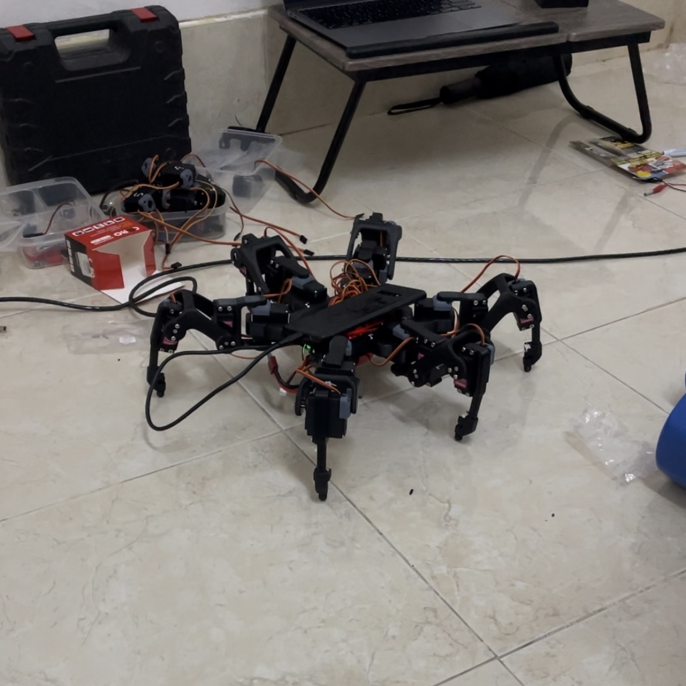

Hexapod เป็นหุ่นยนต์ 6 ขา ที่ผมทำการศึกษาการเคลื่อนที่ของพวกแมลงและออกแบบระแบบการเคลื่อนที่ที่ สามารถแปลงไปเป็น code แล้วนำมาคำนวนและขยับไปในทิศทางที่ต้องการ

ในการประดิษฐ์ ผมใช้ชิ้นส่วนที่ออกแบบ 3 มิติและนำมาปริ้นบนเครื่องปริ้น 3 มิติ ตัวหุ่นยนต์มีตัวคำนวน คือโทรศัพท์เพราะว่าเครื่องมันเล็กและมี sensor หลายอย่างครบในเครื่องเดียวแทนที่ว่าจะต่ออุปกรณ์กันเยอะ และตัวคุค กลไก (servo กับ touch sensor) เป็น servo2040 ใช้ chip [RP2040](https://github.com/pimoroni/pimoroni-pico) โดยเขียน firmware บนภาษา C ให้คุยกับ โทรศัพท์ผ่านระแบบ VCP CDC [VCP via USB-C](https://community.st.com/t5/stm32-mcus-embedded-software/stm32-vcp-by-usbc-cable-to-android-app/td-p/196371) 

ในโครงงานนี้ผมได้เรียนรู้ระแบบ inverse kinematics และ forward kinematics อย่างละเอียด รวมถึงการประยุคไปใช้ในภาษา C, การส่งข้อมูลผ่าน USB VCP และ การใช้โปรแกรม [Plasticity](https://www.plasticity.xyz/#features) ในการออกแบบชิ้นส่วนหุ่นยนต์

ตัวอย่าง code ที่ใช้ในการหาค่าที่ต้องขยับใน Gait:

```cpp
Vector3 getGaitPoint(int leg, float pushFraction){  
 

  float rotateStrideLength = joy2CurrentVector.x * globalRotationMultiplier;
  Vector2 v = joy1CurrentVector * Vector2(1,strideLengthMultiplier);
  v.y = constrain(v.y,-maxStrideLength/2, maxStrideLength/2);
  v = v * globalSpeedMultiplier;

  float weightSum = abs(forwardAmount) + abs(turnAmount);

  float t = tArray[leg];

  //if(leg == 0)print_value("cycleProgress[leg]",cycleProgress[leg]);
  
  
  //Propelling
  if(t < pushFraction){ 
    if(legStates[leg] != Propelling)setCycleStartPoints(leg);
    legStates[leg] = Propelling;

    ControlPoints[0] = cycleStartPoints[leg];
    ControlPoints[1] = Vector3(v.x * strideMultiplier[leg] + distanceFromCenter, -v.y * strideMultiplier[leg], distanceFromGround).rotate(legPlacementAngle * rotationMultiplier[leg], Vector2(distanceFromCenter,0));
    ControlPointsAmount = 2;    
    Vector3 straightPoint = GetPointOnBezierCurve(ControlPoints, ControlPointsAmount, mapFloat(t,0,pushFraction,0,1));

    RotateControlPoints[0] = cycleStartPoints[leg];
    RotateControlPoints[1] = { distanceFromCenter + 40, 0, distanceFromGround };
    RotateControlPoints[2] = { distanceFromCenter, rotateStrideLength, distanceFromGround };
    RotateControlPointsAmount = 3;    
    Vector3 rotatePoint = GetPointOnBezierCurve(RotateControlPoints, RotateControlPointsAmount, mapFloat(t,0,pushFraction,0,1));

    //if(leg == 0)print_value("pushing point",(straightPoint*abs(forwardAmount) + rotatePoint*abs(turnAmount))/ weightSum);

    return (straightPoint*abs(forwardAmount) + rotatePoint*abs(turnAmount))/ weightSum;
  }

  //Lifting
  else{
    if(legStates[leg] != Lifting)setCycleStartPoints(leg);
    legStates[leg] = Lifting;

    ControlPoints[0] = cycleStartPoints[leg];
    ControlPoints[1] = cycleStartPoints[leg] + Vector3(0,0,liftHeight * liftHeightMultiplier);
    ControlPoints[2] = Vector3(-v.x * strideMultiplier[leg] + distanceFromCenter, (v.y + strideOvershoot) * strideMultiplier[leg], distanceFromGround + landHeight).rotate(legPlacementAngle * rotationMultiplier[leg], Vector2(distanceFromCenter,0));
    ControlPoints[3] = Vector3(-v.x * strideMultiplier[leg] + distanceFromCenter, v.y * strideMultiplier[leg], distanceFromGround).rotate(legPlacementAngle * rotationMultiplier[leg], Vector2(distanceFromCenter,0));
    ControlPointsAmount = 4;
    Vector3 straightPoint = GetPointOnBezierCurve(ControlPoints, ControlPointsAmount, mapFloat(t,pushFraction,1,0,1));

    RotateControlPoints[0] = cycleStartPoints[leg];
    RotateControlPoints[1] = cycleStartPoints[leg] + Vector3(0,0,liftHeight * liftHeightMultiplier);
    RotateControlPoints[2] = { distanceFromCenter + 40, 0, distanceFromGround + liftHeight * liftHeightMultiplier};
    RotateControlPoints[3] = { distanceFromCenter, -(rotateStrideLength + strideOvershoot), distanceFromGround + landHeight};
    RotateControlPoints[4] = { distanceFromCenter, -rotateStrideLength, distanceFromGround};
    RotateControlPointsAmount = 5;
    Vector3 rotatePoint =  GetPointOnBezierCurve(RotateControlPoints, RotateControlPointsAmount, mapFloat(t,pushFraction,1,0,1));

    //if(leg == 0)print_value("lifting point",(straightPoint*abs(forwardAmount) + rotatePoint*abs(turnAmount))/ weightSum);

    return (straightPoint*abs(forwardAmount) + rotatePoint*abs(turnAmount))/ weightSum;
  }  
}
```
